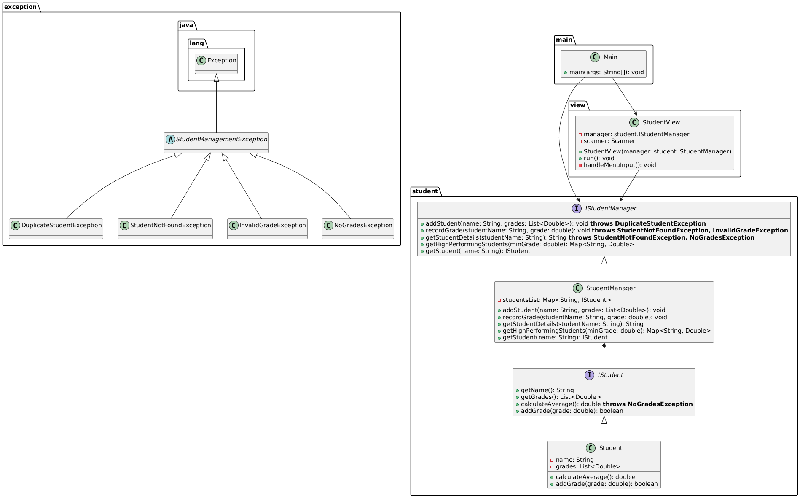

<!-- Improved compatibility of back to top link: See: https://github.com/othneildrew/Best-README-Template/pull/73 -->
<a id="readme-top"></a>
<!--
*** Thanks for checking out the Best-README-Template. If you have a suggestion
*** that would make this better, please fork the repo and create a pull request
*** or simply open an issue with the tag "enhancement".
*** Don't forget to give the project a star!
*** Thanks again! Now go create something AMAZING! :D
-->


<!-- PROJECT SHIELDS -->
<!--
*** I'm using markdown "reference style" links for readability.
*** Reference links are enclosed in brackets [ ] instead of parentheses ( ).
*** See the bottom of this document for the declaration of the reference variables
*** for contributors-url, forks-url, etc. This is an optional, concise syntax you may use.
*** https://www.markdownguide.org/basic-syntax/#reference-style-links
-->
<div align="center">
  
[![Contributors][contributors-shield]][contributors-url]
[![Forks][forks-shield]][forks-url]
[![Stargazers][stars-shield]][stars-url]
[![Issues][issues-shield]][issues-url]
[![LinkedIn][linkedin-shield]][linkedin-url]

</div>


<!-- PROJECT LOGO -->
<br />
<div align="center">

<h1 align="center">Student Management System</h1>

  <p align="center">
    This system is a console application developed in Java to manage student records, their grades, and their academic performance.
    <br />
    <a href="https://github.com/javier-espada/student-management"><strong>Explore the docs »</strong></a>
    <br />
    <br />
    <a href="https://github.com/javier-espada/student-management">View Demo</a>
    &middot;
    <a href="https://github.com/javier-espada/student-management/issues/new?labels=bug&template=bug-report---.md">Report Bug</a>
    &middot;
    <a href="https://github.com/javier-espada/student-management/issues/new?labels=enhancement&template=feature-request---.md">Request Feature</a>
  </p>
</div>


<!-- TABLE OF CONTENTS -->
<details>
  <summary>Table of Contents</summary>
  <ol>
    <li>
      <a href="#project-idea">Project Base Idea</a>
      <ul>
        <li><a href="#key-features">Key Features</a></li>
      </ul>
    </li>
    <li>
      <a href="#system-architecture">System Architecture (MVC)</a>
      <ul>
        <li><a href="#package-structure">2.1. Package Structure</a></li>
      </ul>
    </li>
    <li><a href="#task-distribution">Task Distribution and Leadership</a>    
      <ul>
        <li><a href="#group-1">Group 1</a></li>
      </ul>
      <ul>
        <li><a href="#group-2">Group 2</a></li>
      </ul>
    </li>
    <li><a href="#Github">4. GitHub Workflow and Standards</a>
      <ul>
        <li><a href="#commit">4.1 Commit Convention</a></li>
      </ul>
      <ul>
        <li><a href="#pr">4.2. Pull Request (PR) Workflow</a></li>
      </ul>
      <ul>
        <li><a href="#top-contributors">Top contributors</a></li>
      </ul>
    </li>
    <li><a href="#contact">Contact</a></li>
    <li><a href="#roadmap">Roadmap</a></li>
  </ol>
</details>


<!-- PROJECT IDEA -->
<a id="project-idea"></a>

## 1. Project Base Idea

This system is a console application developed in Java to manage student records, their grades, and their academic performance.

The design adheres strictly to the **Model-View-Controller (MVC)** pattern to ensure a clean separation between business logic and the user interface.

<p align="right">(<a href="#readme-top">back to top</a>)</p>


<a id="key-features"></a>

### 1.1 Key Features

* **Student Addition:** Guaranteed unique names.
* **Grade Recording:** Range validation (0.0 to 10.0).
* **Average Calculation:** Calculation and display of averages rounded to two decimal places.
* **Advanced Query:** Retrieval of high-performing students whose average exceeds a specific threshold.
* **Robustness:** Handling of custom exceptions for data errors.

<p align="right">(<a href="#readme-top">back to top</a>)</p>


<!-- SYSTEM ARCHITECTURE -->
<a id="system-architecture"></a>

## 2. System Architecture (MVC)

The system is logically divided into three primary layers: Model, View, and Exceptions.

<details>
  <summary>Click to expand the UML Class Diagram</summary>
  <p>
    <br />
    
  </p>
</details>

<a id="package-structure"></a>

### 2.1. Package Structure

The file organization is designed to follow standard Java and MVC conventions, isolating responsibilities:


```

src/
└── com/
├── main/                              # Configuration
│   └── Main.java                      # Startup Point (Launcher)
│
├── model/                             # Model (Business Logic and Data)
│   ├── IStudent.java                  # Student Entity Interface
│   ├── Student.java                   # Data Entity Implementation
│   └── StudentManager.java            # Collection Manager/Service
│
├── view/                              # View and Controller (UI)
│   └── StudentView.java               # Menu, Input/Output, Controller Logic
│
├── exception/                         # Error Handling
│   ├── StudentException.java
│   └── ...
└── tests/                             # JUnit Tests
    └──StudentException.java

```

<p align="right">(<a href="#readme-top">back to top</a>)</p>


<!-- TASK DISTRIBUTION -->
<a id="task-distribution"></a>

## 3. Task Distribution and Leadership

**Project Leader:** **Guzmán**

<a id="group-1"></a>

### Group 1: Model Development (Leader: Guzmán)

| Member | Project Role | Main Task | Focus |
| :--- | :--- | :--- | :--- |
| **<a href="https://github.com/guzmangriancho">Guzmán</a>** | Group Leader / Developer | `StudentManager.java` (Implementation of all management logic, search, exceptions). | **Model Controller / Group 1 Integrator.** |
| **<a href="https://github.com/RecepBorekciQaracter">Recep</a>** | Developer | `Student.java` (Implementation of `IStudent`), `IStudent.java` (Definition of the interface). | **Data Object / Contract Definition.** |
| **<a href="https://github.com/javier-espada">Javier</a>** | Pull Request Reviewer / Architect| Ensure Group 1's code meets standards. | **Quality Assurance (QA).** |

<a id="group-2"></a>

### Group 2: View, Controller, and Testing (Leader: Miguel)

| Member | Project Role | Main Task | Focus |
| :--- | :--- | :--- | :--- |
| **<a href="https://github.com/Miguel901288">Miguel</a>** | Group Leader / Developer | `Main.java` (MVC Config). `StudentView.run()`. PR Reviewer. Basic JUnit Tests. | **Structure/Integration and QA.** |
| **<a href="https://github.com/CarlosQaracter">Carlos</a>** | Developer | `StudentView` (Implementation of CRUD handlers, `try-catch` handling for all exceptions). Exception JUnit Tests. | **Interface and Robustness.** |
| **<a href="https://github.com/Davidsar11">David</a>** | Developer | `getHighPerformingStudents` (in `StudentManager`). Handler for this query in `StudentView`. Functional JUnit Tests. | **Advanced Query Logic and QA.** |

<p align="right">(<a href="#readme-top">back to top</a>)</p>


<!-- GITHUB WORKFLOW -->
<a id="github"></a>

## 4. GitHub Workflow and Standards

All development will be carried out using feature branches and **Pull Requests (PRs)** to ensure the `main` branch remains stable.

<a id="commit"></a>

### 4.1. Commit Convention
 
We will use the commit standard **Type(area): Brief description**.
 
| Commit Type | When to Use | Example |
| :--- | :--- | :--- |
| `feat:` | When a new feature is added. | `feat: Add getHighPerformingStudents method` |
| `fix:` | When a code error is corrected. | `fix: Fix error when reading non-numeric input` |
| `test:` | When unit tests are added or modified. | `test: Cover DuplicateStudentException case` |
| `docs:` | When documentation is updated (README, comments). | `docs: Update task distribution section` |

<a id="pr"></a>

### 4.2. Pull Request (PR) Workflow
 
1.  **Branch Creation:** Before starting any work, the developer must create a branch with a descriptive name: `feature/[description]`
    * *Example:* `feature/student-manager`
2.  **Development and Commit:** Make changes and commit following the convention (`feat:`, `fix:`, etc.).
3.  **PR Opening:** Once the work is complete, the developer opens a Pull Request (PR) targeting the `main` branch.
4.  **Assigning Reviewer:**
    * **Javier** is the assigned reviewer for **Model** changes (Group 1).
    * **Guzmán** (Leader) has the authority to approve and merge all PRs.
5.  **Review and Merge:** The reviewer reviews the code. If approved, the PR is merged into `main`.

<a id="top-contributors"></a>

### Top contributors:

<a href="https://github.com/javier-espada/student-management/graphs/contributors">
  
</a>

<p align="right">(<a href="#readme-top">back to top</a>)</p>


<!-- CONTACT -->
<a id="contact"></a>

## 5. Contact

Your Name - javier.espada@qaracter.com

Project Link: [https://github.com/javier-espada/student-management](https://github.com/javier-espada/student-management)

<p align="right">(<a href="#readme-top">back to top</a>)</p>


<!-- ROADMAP -->
<a id="roadmap"></a>

## 6. Roadmap
### Day 1
- [ ] Documentation Updates
    - [ ] README.md Updates
- [x] Full Model Build.
    - [x] Create IStudent interface.
    - [x] Create IStudentManager interface.
    - [x] Create Student class with attributes and constructor.
    - [x] Create StudentManager class with the students HashMap
    - [x] Implement addStudent, recordGrade, and calculateAverage methods.
- [x] Manage exceptions.
    - [x] Create the 4 custom exception classes.

### Day 2
- [x] Final model functionalities
    - [x] Implement getHighPerformingStudents logic by threshold.
- [x] View Creation
    - [x] Create StudentView class with the menu and Scanner to read data.
- [x] Main creation
    - [x] Create Main class to start the program using try-catch blocks to handle expected exceptions.
- [ ] Testing.
    - [ ] Create and execute basic JUnit tests.
- [x] Final integration
    - [x] Perform a final integration session to connect Group 1's StudentManager with Group 2's StudentView and verify that the entire data flow works correctly.

### Future Implementations
- [ ] Use Jacoco to check coverage.
- [ ] Implement local database with a simple text/json file.

See the [open issues](https://github.com/javier-espada/student-management/issues) for a full list of proposed features (and known issues).

<p align="right">(<a href="#readme-top">back to top</a>)</p>


<!-- MARKDOWN LINKS & IMAGES -->
<!-- https://www.markdownguide.org/basic-syntax/#reference-style-links -->
[contributors-shield]: https://img.shields.io/github/contributors/javier-espada/student-management.svg?style=for-the-badge
[contributors-url]: https://github.com/javier-espada/student-management/graphs/contributors
[forks-shield]: https://img.shields.io/github/forks/javier-espada/student-management.svg?style=for-the-badge
[forks-url]: https://github.com/javier-espada/student-management/network/members
[stars-shield]: https://img.shields.io/github/stars/javier-espada/student-management.svg?style=for-the-badge
[stars-url]: https://github.com/javier-espada/student-management/stargazers
[issues-shield]: https://img.shields.io/github/issues/javier-espada/student-management.svg?style=for-the-badge
[issues-url]: https://github.com/javier-espada/student-management/issues
[license-shield]: https://img.shields.io/github/license/javier-espada/student-management.svg?style=for-the-badge
[license-url]: https://github.com/javier-espada/student-management/blob/master/LICENSE.txt
[linkedin-shield]: https://img.shields.io/badge/-LinkedIn-black.svg?style=for-the-badge&logo=linkedin&colorB=555
[linkedin-url]: https://linkedin.com/in/javier-espada
[product-screenshot]: images/screenshot.png
<!-- Shields.io badges. You can a comprehensive list with many more badges at: https://github.com/inttter/md-badges -->
[Next.js]: https://img.shields.io/badge/next.js-000000?style=for-the-badge&logo=nextdotjs&logoColor=white
[Next-url]: https://nextjs.org/
[React.js]: https://img.shields.io/badge/React-20232A?style=for-the-badge&logo=react&logoColor=61DAFB
[React-url]: https://reactjs.org/
[Vue.js]: https://img.shields.io/badge/Vue.js-35495E?style=for-the-badge&logo=vuedotjs&logoColor=4FC08D
[Vue-url]: https://vuejs.org/
[Angular.io]: https://img.shields.io/badge/Angular-DD0031?style=for-the-badge&logo=angular&logoColor=white
[Angular-url]: https://angular.io/
[Svelte.dev]: https://img.shields.io/badge/Svelte-4A4A55?style=for-the-badge&logo=svelte&logoColor=FF3E00
[Svelte-url]: https://svelte.dev/
[Laravel.com]: https://img.shields.io/badge/Laravel-FF2D20?style=for-the-badge&logo=laravel&logoColor=white
[Laravel-url]: https://laravel.com
[Bootstrap.com]: https://img.shields.io/badge/Bootstrap-563D7C?style=for-the-badge&logo=bootstrap&logoColor=white
[Bootstrap-url]: https://getbootstrap.com
[JQuery.com]: https://img.shields.io/badge/jQuery-0769AD?style=for-the-badge&logo=jquery&logoColor=white
[JQuery-url]: https://jquery.com 
